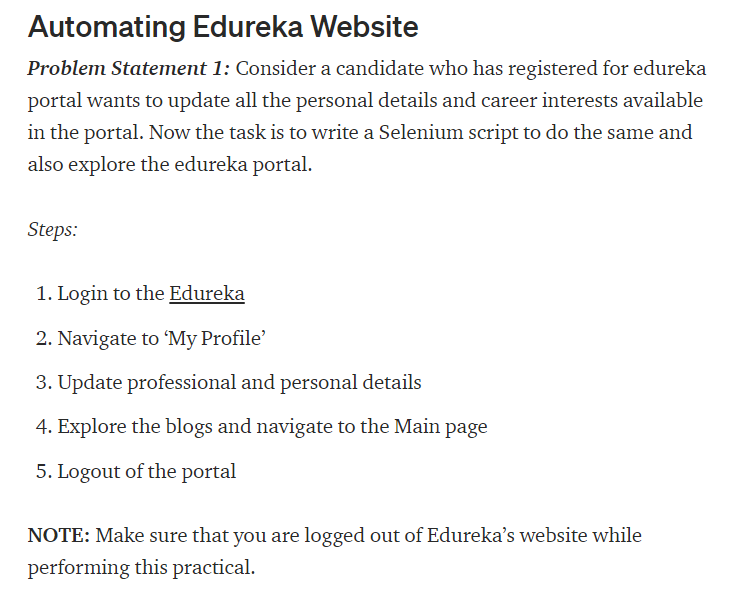

# Automatizando Edureka

Projeto feita para o Treinamento de Selenium e java.

Como foi Pedido que o Usuario Atualize, não funcional a Contas novas sem nenhuma informação.

Executado em JDK 8.

Estrutura do Projeto:

 
